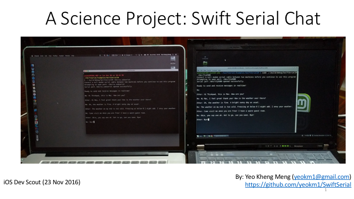

# SwiftSerial
A Swift 3 Linux and Mac library for reading and writing to serial ports. This library has been tested to work on macOS Sierra, Linux Mint 18 (based on Ubuntu 16.04) and on the [Raspberry Pi 3 on Ubuntu 16.04](https://wiki.ubuntu.com/ARM/RaspberryPi). Other platforms using Ubuntu like the Beaglebone might work as well.

This library is an improvement over my previous now deprecated library [SwiftLinuxSerial](https://github.com/yeokm1/SwiftLinuxSerial) which was less Swifty and supported only Linux. This library is thanks largely to [Jay Jun](https://github.com/jayjun). His original pull request can be found [here](https://github.com/yeokm1/SwiftLinuxSerial/pull/1).

<p>


<a href="https://developer.apple.com/swift"></a>
<a href="https://raw.githubusercontent.com/uraimo/SwiftyGPIO/master/LICENSE"></a>

## Talk on this library

I gave a talk on this library and one of its examples SwiftSerialIM. Click on the links below to see the slides and video.

[](http://www.slideshare.net/yeokm1/a-science-project-swift-serial-chat)

[](https://www.youtube.com/watch?v=6PWP1eZo53s)

## Mac OS Preparation

You should have Xcode 8 installed with the command line tools.

## Linux System Preparation

Before using this library, I assume you already have Ubuntu installed and fully updated on your system or single-board computer. To get Ubuntu installed on the Raspberry Pi, use this [link](https://wiki.ubuntu.com/ARM/RaspberryPi).

### Install Swift 3 on Ubuntu on x86-based machines

Reference instructions obtained from [here](http://dev.iachieved.it/iachievedit/swift-3-0-for-ubuntu-16-04-xenial-xerus/). We will use a Swift binary produced by iachievedit.
```bash
#Add the repository key for iachievedit
wget -qO- http://dev.iachieved.it/iachievedit.gpg.key | sudo apt-key add -

#Add the Xenial repository to sources.list
echo "deb http://iachievedit-repos.s3.amazonaws.com/ xenial main" | sudo tee --append /etc/apt/sources.list

sudo apt-get update
sudo apt-get install swift-3.0

nano ~/.profile
#This command can be added to your bash profile so Swift will be in your PATH after a reboot
export PATH=/opt/swift/swift-3.0/usr/bin:$PATH
```

### Install Swift 3 on Ubuntu on Raspberry Pi 3
Instructions from this section is referenced from this [link](http://dev.iachieved.it/iachievedit/swift-3-0-on-raspberry-pi-2-and-3/).

Since Swift 3 is still rapidly evolving, we should not use the Swift packages provided via the apt package manager if they exist and instead use prebuilt binaries instead. We will also not install Swift 3 to the system-level directories to avoid problems in case we have to update the version.

Go to this [page](http://swift-arm.ddns.net/job/Swift-3.0-Pi3-ARM-Incremental/lastSuccessfulBuild/artifact/) and find what it is the link to the latest Swift compiled `tar.gz` package.

```bash
#Install dependencies
sudo apt-get install libcurl4-openssl-dev libicu-dev clang-3.6
sudo update-alternatives --install /usr/bin/clang clang /usr/bin/clang-3.6 100
sudo update-alternatives --install /usr/bin/clang++ clang++ /usr/bin/clang++-3.6 100

cd ~
#Replace the link below with the latest version
wget http://swift-arm.ddns.net/job/Swift-3.0-Pi3-ARM-Incremental/lastSuccessfulBuild/artifact/swift-3.0-2016-10-13-RPi23-ubuntu16.04.tar.gz
mkdir swift-3.0
cd swift-3.0 && tar -xzf ../swift-3.0-2016-10-13-RPi23-ubuntu16.04.tar.gz

#This command can be added to your bash profile so Swift will be in your PATH after a reboot
nano ~/.profile
export PATH=$HOME/swift-3.0/usr/bin:$PATH
```
## Jumping straight into sample code
To get started quickly, you can take a look at my example projects [here](Examples/).

### Example 1: Loopback Test

In order to run this example properly, you need to connect one of your (USB/UART) serial ports in a loopback manner. Basically, you short the TX and RX pins of the serial port. This library currently only support the `/dev/cu.*` variant on Mac. Read the beginning of the API usage section for more details.

```bash
git clone https://github.com/yeokm1/SwiftSerial.git
cd SwiftSerial/Examples/SwiftSerialExample/
swift build

#For Linux: You need root to access the serial port. Replace /dev/ttyUSB0 with the name of your serial port under test
sudo ./.build/debug/SwiftSerialExample /dev/ttyUSB0

#For Mac: Root is not required
./.build/debug/SwiftSerialExample /dev/cu.usbserial

#If all goes well you should see a series of messages informing you that data transmitted has been received properly.
```

### Example 2: A chat app between 2 machines

In order to run this example properly, you need 2 machines connected by a [null-modem cable](https://en.wikipedia.org/wiki/Null_modem) or 2 USB-Serial adapters with the TX-RX pins connected to each other. Run a copy of my program on both machines.

```bash
git clone https://github.com/yeokm1/SwiftSerial.git
cd SwiftSerial/Examples/SwiftSerialIM/
swift build

#For Linux: You need root to access the serial port. Replace /dev/ttyUSB0 with the name of your serial port under test
sudo ./.build/debug/SwiftSerialIM /dev/ttyUSB0

#For Mac: Root is not required
./.build/debug/SwiftSerialIM /dev/cu.usbserial
```
People at both machines can now "chat" with each other.

## Integrating with your project

Add SwiftSerial as a dependency to your project by editing the `Package.swift` file.

```swift
let package = Package(
    name: "NameOfMyProject",
    dependencies: [
        .Package(url: "https://github.com/yeokm1/SwiftSerial.git", majorVersion: 0),
        ...
    ]
    ...
)
```

Make sure to `import SwiftSerial` in the source files that use my API.

Then run `swift build` to download the dependencies and compile your project. Your executable will be found in the `./.build/debug/` directory.

## API usage

### Initialise the class

```swift
let serialPort: SerialPort = SerialPort(path: portName)
```
Supply the portname that you wish to open like `/dev/ttyUSB0` or `/dev/cu.usbserial`.

For Macs, this library currently only works with the `/dev/cu.*` ports instead of the `/dev/tty.*`. I have enabled blocking on the serial port to prevent high CPU usage which will prevent the `/dev/tty.*` from working. Read more about the differences between the two [here](http://stackoverflow.com/questions/8632586/macos-whats-the-difference-between-dev-tty-and-dev-cu). If there is a problem, open an issue describing your situation and let me look into it.

### Opening the Serial Port

```swift
func openPort()
func openPort(toReceive receive: Bool, andTransmit transmit: Bool)
```
Opening the port without any parameters will set the port to receive and transmit by default. You can still choose to receive-only, transmit-only or both. Will throw `PortError.mustReceiveOrTransmit` if you set both parameters to false. Can also throw `PortError.failedToOpen` and `PortError.invalidPath`.

### Set port settings

```swift
serialPort.setSettings(receiveRate: .baud9600, transmitRate: .baud9600, minimumBytesToRead: 1)
```
The port settings call can be as simple as the above. For the baud rate, just supply both transmit and receive even if you are only intending to use one transfer direction. For example, transmitRate will be ignored if you specified `andTransmit : false` when opening the port.

`minimumBytesToRead` determines how many characters the system must wait to receive before it will return from a [read()](https://linux.die.net/man/2/read) function. If in doubt, just put 1.

This function has been defined with default settings as shown in the function definition.

```swift
func setSettings(receiveRate: BaudRate,
                 transmitRate: BaudRate,
                 minimumBytesToRead: Int,
                 timeout: Int = 0, /* 0 means wait indefinitely */
                 parityType: ParityType = .none,
                 sendTwoStopBits: Bool = false, /* 1 stop bit is the default */
                 dataBitsSize: DataBitsSize = .bits8,
                 useHardwareFlowControl: Bool = false,
                 useSoftwareFlowControl: Bool = false,
                 processOutput: Bool = false)
```
If the default settings do not suit you, just pass in extra parameters to override them.

### Reading data from port

There are several functions you can use to read data. All functions here are blocking till the expected number of bytes has been received or a condition has been met. All functions can throw `PortError.mustBeOpen`.

```swift
func readString(ofLength length: Int) throws -> String
```
This is the easiest to use if you are sending text data. Just provide how many bytes you expect to read. The result will then be returned as a typical Swift String. This function internally calls `readData()`.

```swift
func readData(ofLength length: Int) throws -> Data
```
This function is if you intend to receive binary data. This function internally calls `readBytes()`

```swift
func readBytes(into buffer: UnsafeMutablePointer<UInt8>, size: Int) throws -> Int
```
If you intend to play with unsafe pointers directly, this is the function for you! Will return the number of bytes read. Note that you are responsible for allocating the pointer before passing into this function then deallocate the pointer once you are done.

```swift
func readLine() throws -> String
```
Read byte by byte till the newline character `\n` is encountered. A String containing the result so far will be returned without the newline character. This function internally calls `readUntilChar()`. Can throw `PortError.stringsMustBeUTF8`.

```swift
func readUntilChar(_ terminator: CChar) throws -> String
```
Keep reading until the specified CChar is encountered. Return the string read so far without that value.

```swift
func readByte() throws -> UInt8
```
Read only one byte. This works best if `minimumBytesToRead` has been set to `1` when opening the port. This function internally calls `readBytes()`.

```swift
func readChar() throws -> UnicodeScalar
```
Read only one character. This works best if `minimumBytesToRead` has been set to `1` when opening the port. This function internally calls `readByte()`.

```swift
func readUntilBytes(stopBytes: [UInt8], maxBytes: Int) throws -> [UInt8]
```
Read bytes until stop bytes found or maxBytes count was recieved
### Writing data to the port

There are several functions you can use to write data. All functions here are blocking till all the data has been written. All functions can throw `PortError.mustBeOpen`.

```swift
func writeString(_ string: String) throws -> Int
```
Most straightforward function, String in then transmit! Will return how many bytes actually written. Internally calls `writeData()`

```swift
func writeData(_ data: Data) throws -> Int
```
Binary data in, then transmit! Will return how many bytes actually written. Internally calls `writeBytes()`.

```swift
func writeBytes(from buffer: UnsafeMutablePointer<UInt8>, size: Int) throws -> Int
```
Function for those that want to mess with unsafe pointers. You have to specify how many bytes have to be written. Will return how many bytes actually written.

```swift
func writeChar(_ character: UnicodeScalar) throws -> Int{
```
Writes only one character. Will return `1` if successful. This function internally calls `writeString()`. Pull requests for a better way of doing this is appreciated.

### Closing the port

Just do `serialPort.closePort()` to close the port once you are done using it.

## External References

This library cannot be written without the amazing reference code I depended on.

1. [Xanthium's Serial Port Programming on Linux](http://xanthium.in/Serial-Port-Programming-on-Linux)
2. [Chrishey Drick's Reading data from Serial Port](https://chrisheydrick.com/2012/06/17/how-to-read-serial-data-from-an-arduino-in-linux-with-c-part-3/)
